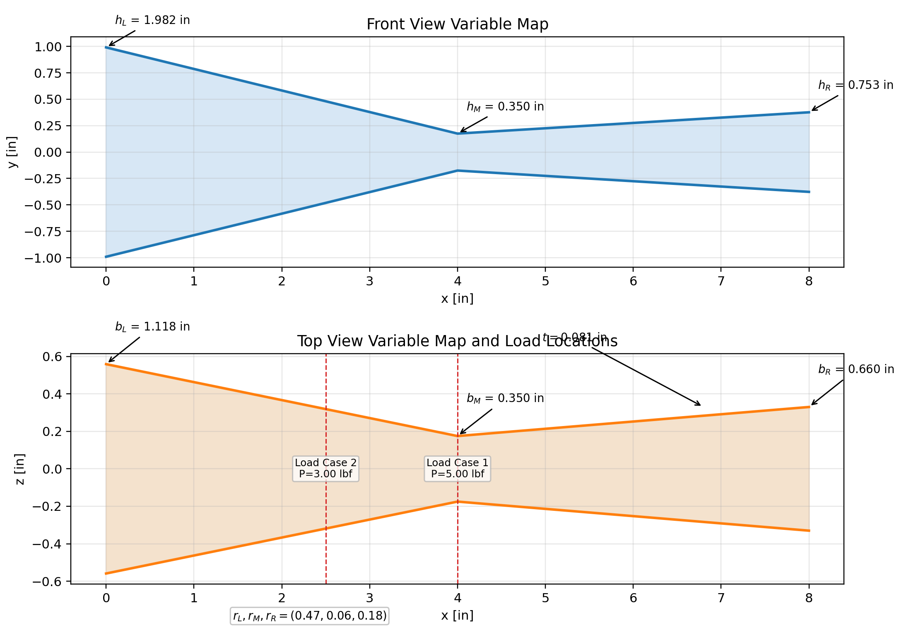
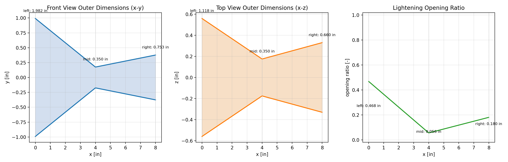

# Beam Optimization Report

## Search Summary

- Search method: stratified global sampling with elite local refinement
- Total evaluated designs: 540
- Feasible designs found: 313
- Minimum required factor of safety: 1.500
- Objective shaping: penalize excess FoS margin and underutilized stress envelope so the design approaches the 1.5 target more closely
- Maximum allowed deflection: not enforced in this run
- Random seed: 305

## Best Design

- Weight: 0.06614 lbf
- Minimum factor of safety: 1.553
- Excess FoS above target: 0.053
- Governing minimum-FoS load case: Load Case 1 at x = 4.000 in
- Maximum deflection: 0.05775 in
- Constraint status: feasible

### Geometry Variables

| Variable | Value |
| --- | ---: |
| $L$ [in] | 8.000 |
| $L_{total}$ [in] | 9.000 |
| $b_L$ [in] | 1.118 |
| $b_M$ [in] | 0.350 |
| $b_R$ [in] | 0.660 |
| $h_L$ [in] | 1.982 |
| $h_M$ [in] | 0.350 |
| $h_R$ [in] | 0.753 |
| $t$ [in] | 0.081 |
| $r_L$ [-] | 0.468 |
| $r_M$ [-] | 0.056 |
| $r_R$ [-] | 0.180 |
| $E_{eff}$ [psi] | 297500.0 |
| $\sigma_{allow,eff}$ [psi] | 2380.0 |

### Best-Design Load-Case Metrics

| Load Case | Orientation | Load [lbf] | Location [in] | Min FoS | FoS x [in] | Max Deflection [in] | Max von Mises [psi] |
| --- | --- | ---: | ---: | ---: | ---: | ---: | ---: |
| Load Case 1 | upright | 5.000 | 4.000 | 1.553 | 4.000 | 0.05775 | 1532.7 |
| Load Case 2 | side | 3.000 | 2.500 | 4.141 | 4.000 | 0.02681 | 574.8 |

## Beam Structure and Parameters

## General Equations

### Geometry

- $$b(x)=\begin{cases}1.1178 + (-0.1919)x, & 0 \le x \le 4.0000\\0.3500 + (0.0776)(x-4.0000), & 4.0000 < x \le 8.0000\end{cases}$$
- $$h(x)=\begin{cases}1.9820 + (-0.4080)x, & 0 \le x \le 4.0000\\0.3500 + (0.1008)(x-4.0000), & 4.0000 < x \le 8.0000\end{cases}$$
- $$r(x)=\begin{cases}0.4683 + (-0.1032)x, & 0 \le x \le 4.0000\\0.0556 + (0.0312)(x-4.0000), & 4.0000 < x \le 8.0000\end{cases}$$
- Hollow tube area with lightening openings: $A(x)=2b(x)t + [1-r(x)]2t[h(x)-2t]$
- Upright bending second moment: $I(x)=\frac{b(x)h(x)^3-[b(x)-2t][h(x)-2t]^3}{12}-2\frac{t[r(x)(h(x)-2t)]^3}{12}$
- Side-rotated bending second moment: $I_{side}(x)=\frac{h(x)b(x)^3-[h(x)-2t][b(x)-2t]^3}{12}-2\frac{t[r(x)(b(x)-2t)]^3}{12}$
- Section modulus: $S(x)=I(x)/c(x)$ with $c(x)=\text{outer vertical dimension}/2$

### Statics and Stress

- Reactions for a point load $P$ at $x=a$: $R_A=P(L-a)/L$, $R_B=Pa/L$
- Shear and moment: $V(x)$ and $M(x)$ are computed piecewise from the reactions and applied load
- Bending stress: $\sigma_b(x)=|M(x)|/S(x)$
- Shear stress estimate: $\tau(x)=|V(x)|/A_{shear}(x)$ with $A_{shear}(x)=[1-r(x)]2t\,h_{clear}(x)$ for the active orientation
- von Mises stress: $\sigma_{vm}(x)=\sqrt{\sigma_b(x)^2+3\tau(x)^2}$
- Factor of safety: $FoS(x)=\sigma_{allow,eff}/\sigma_{vm}(x)$

### Deflection and Objective

- Euler-Bernoulli relation: $E_{eff}I(x)v''(x)=M(x)$
- Weight objective: $W=\rho\int_0^L A(x)\,dx$
- Search objective used here: minimize weight while enforcing factor-of-safety and optional deflection constraints

## Automatic Equation Substitution

### Effective Material Properties

- $E_{eff} = E \times k_{orientation} \times k_{infill} = 500000.0 \times 0.700 \times 0.850 = 297500.0\ \text{psi}$
- $\sigma_{allow,eff} = \sigma_{allow} \times k_{orientation} \times k_{infill} = 4000.0 \times 0.700 \times 0.850 = 2380.0\ \text{psi}$
- $W = \rho \int_0^L A(x)\,dx = 0.06614\ \text{lbf}$
- Global governing factor of safety is the minimum value over all beam stations and over both load cases.

### Load Case 1

- Active bending orientation: upright (upright section properties)
- $R_A = P(L-a)/L = 5.000(8.000-4.000)/8.000 = 2.500\ \text{lbf}$
- $R_B = Pa/L = 5.000(4.000)/8.000 = 2.500\ \text{lbf}$
- $FoS_{min} = \sigma_{allow,eff}/\sigma_{vm,max} = 2380.0/1532.7 = 1.553$
- Governing location for this load case: $x = 4.000\ \text{in}$
- $\max |v(x)| = 0.05775\ \text{in}$
- $\max |\theta(x)| = 0.019443\ \text{rad}$

### Load Case 2

- Active bending orientation: side (side-rotated section properties)
- $R_A = P(L-a)/L = 3.000(8.000-2.500)/8.000 = 2.062\ \text{lbf}$
- $R_B = Pa/L = 3.000(2.500)/8.000 = 0.938\ \text{lbf}$
- $FoS_{min} = \sigma_{allow,eff}/\sigma_{vm,max} = 2380.0/574.8 = 4.141$
- Governing location for this load case: $x = 4.000\ \text{in}$
- $\max |v(x)| = 0.02681\ \text{in}$
- $\max |\theta(x)| = 0.008859\ \text{rad}$

## Automatic Trail of Tried Designs

- Full design study table: `design_study.csv`
- Best design record: `best_design.json`
- Best-design plots folder: `best_design/`
